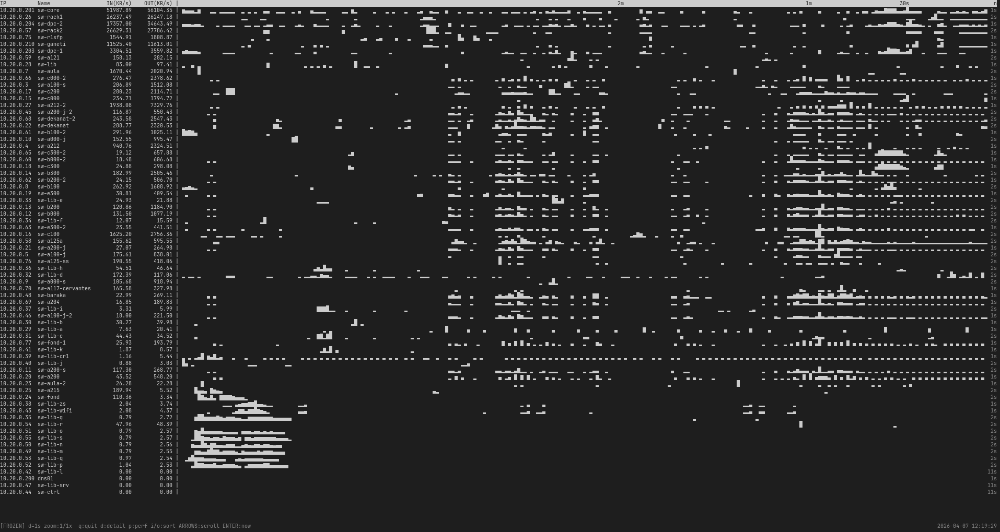

# mifstat — Multi-switch SNMP Bandwidth Monitor



`mifstat` is a real-time, terminal-based bandwidth monitor for multiple SNMP-enabled switches. It provides a consolidated view of traffic across all your network devices with live sparklines, performance metrics, and detailed per-port views.

## Features

- **Multi-Switch Monitoring**: Polls dozens of switches concurrently using SNMP BulkWalk.
- **Real-time Sparklines**: High-resolution history visualization using Unicode block characters.
- **TUI Interface**: Interactive terminal UI with sorting, zooming, and detailed port views.
- **Benchmark Mode**: Diagnoses slow or failing switches with precise timing information.
- **State Persistence**: Saves history between restarts to maintain continuity.
- **Efficient**: Single binary, no external dependencies (except Go runtime for building).
- **Flexible Configuration**: Supports comment lines in switch lists and customizable SNMP communities.

## Installation

### Using Makefile (Recommended)

```bash
git clone https://github.com/dpavlin/mifstat-go.git
cd mifstat-go
make build
# Binary 'mifstat' will be created in the current directory
```

### Via Go Install

```bash
go install github.com/dpavlin/mifstat-go@latest
```

## Usage

### Switch List

`mifstat` expects a list of switches (default path `/dev/shm/sw-ip-name-mac`, can be changed with `-f`). The format is:

```text
# IP_ADDRESS NAME [MAC_ADDRESS]
10.20.0.1  core-switch-01
10.20.0.2  edge-switch-02
```

See `examples/switches.txt.sample` for more details.

### Basic Commands

```bash
# Start the TUI
./mifstat

# Run a one-shot benchmark
./mifstat -bench

# Use a custom switch list and SNMP community
./mifstat -f my_switches.txt -c my_secret_community

# Change poll interval
./mifstat -d 2.0
```

### Interactive Keys

- `q`: Quit
- `d`: Toggle detailed port view
- `p`: Toggle performance metrics
- `i`: Sort by IN traffic
- `o`: Sort by OUT traffic
- `1`: Sort by IP
- `2`: Sort by Name
- `+` / `-`: Zoom in/out on sparklines
- `Left` / `Right`: Scroll through history
- `Enter`: Reset scroll to now
- `Space`: Toggle auto-sort (freeze view)

## Configuration Options

- `-c string`: SNMP community string (overrides `~/.config/snmp.community` and default `public`).
- `-f string`: Path to switch list file (default `/dev/shm/sw-ip-name-mac`).
- `-state string`: Path to save history state (default `/tmp/mifstat_go.bin`).
- `-d float`: Poll interval in seconds (default `1.0`).
- `-snmptimeout duration`: SNMP timeout per poll (default `3s`).
- `-log string`: Path to log SNMP errors and performance.
- `-bench`: Run benchmark mode and exit.
- `-slowms int`: Log polls slower than this many milliseconds (default `500`).
- `-version`: Show version and exit.

## Development

The project is split into several modules for easier maintenance:
- `main.go`: Entry point, TUI loop, and flags.
- `types.go`: Struct definitions and common types.
- `snmp_poll.go`: SNMP polling and OID processing.
- `sparkline.go`: High-resolution visualization logic.
- `state.go`: Binary history persistence.
- `benchmark.go`: Performance testing and diagnostics.

## License

MIT
